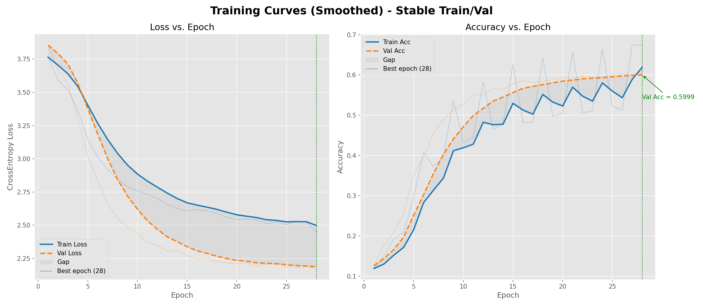
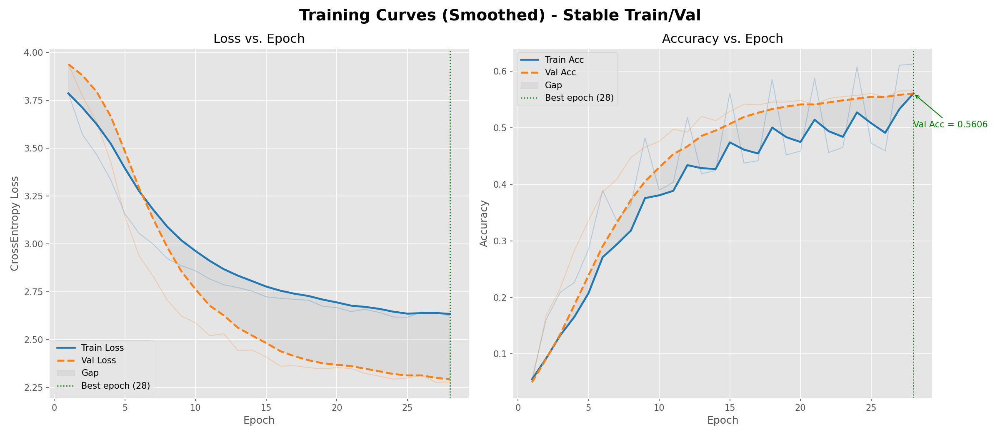
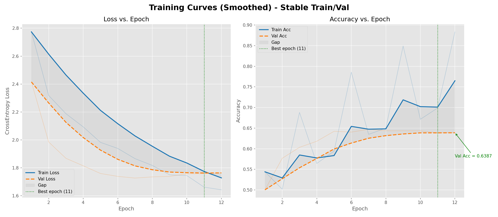

# 💊 THUOC - Hệ thống phân loại viên thuốc bằng Deep Learning

> **Nhóm nghiên cứu:** VLU.AI-Med Team - Trường Đại học Văn Lang  
> **Học phần:** Nhập môn Phân tích dữ liệu và Học sâu  
> **Định hướng:** Nghiên cứu khoa học sinh viên, ứng dụng AI vào bài toán y tế số

---

## 📑 Mục lục
- [1. Tóm tắt đề tài](#1-tóm-tắt-đề-tài)
- [2. Mục tiêu và phạm vi nghiên cứu](#2-mục-tiêu-và-phạm-vi-nghiên-cứu)
- [3. Kiến trúc hệ thống](#3-kiến-trúc-hệ-thống)
- [4. Dữ liệu và tiền xử lý](#4-dữ-liệu-và-tiền-xử-lý)
- [5. Phương pháp mô hình](#5-phương-pháp-mô-hình)
- [6. Chiến lược huấn luyện](#6-chiến-lược-huấn-luyện)
- [7. Kết quả thực nghiệm và hình minh họa](#7-kết-quả-thực-nghiệm-và-hình-minh-họa)
- [8. Triển khai Web và tích hợp hệ thống](#8-triển-khai-web-và-tích-hợp-hệ-thống)
- [9. Hướng dẫn cài đặt và vận hành](#9-hướng-dẫn-cài-đặt-và-vận-hành)
- [10. Câu hỏi thường gặp (FAQ)](#10-câu-hỏi-thường-gặp-faq)
- [11. Lợi ích thực tiễn và hướng phát triển tương lai](#11-lợi-ích-thực-tiễn-và-hướng-phát-triển-tương-lai)
- [12. Cấu trúc dự án](#12-cấu-trúc-dự-án)
- [13. Đóng góp nhóm nghiên cứu](#13-đóng-góp-nhóm-nghiên-cứu)
- [14. Giấy phép](#14-giấy-phép)
- [15. Cấu hình máy khuyến nghị và gợi ý Colab/Cloud GPU](#15-cấu-hình-máy-khuyến-nghị-và-gợi-ý-colabcloud-gpu)

---

## 1. Tóm tắt đề tài
THUOC là hệ thống nhận diện viên thuốc từ ảnh sử dụng deep learning, hướng tới hai bài toán thực tế:

- Phân loại ảnh viên thuốc theo lớp thuốc.
- Kiểm tra thuốc có thuộc toa hay ngoài toa (true/false) bằng ngữ cảnh đơn thuốc.

Dự án xây dựng pipeline đầy đủ từ huấn luyện đến triển khai:

- Train nhiều mô hình (ResNet50, EfficientNet-B0, ViT-B/16).
- Evaluate và so sánh bằng Accuracy, Macro-F1, confusion matrix.
- Ensemble soft-voting để tăng độ ổn định.
- Triển khai Web Flask cho thao tác thực tế trên ảnh upload/camera.

---

## 2. Mục tiêu và phạm vi nghiên cứu
### 2.1. Mục tiêu
- Xây dựng quy trình phân loại ảnh viên thuốc có thể tái sử dụng trong môi trường học thuật và nghiên cứu ứng dụng.
- Tạo giao diện Web dễ dùng cho người dùng không chuyên kỹ thuật.
- Đảm bảo đầu ra rõ ràng cho bài toán hỗ trợ kiểm soát đơn thuốc.

### 2.2. Phạm vi
- Dữ liệu ưu tiên: data_aligned, cấu trúc train/val/test đồng nhất class folders.
- Số lớp không hardcode, phụ thuộc dataset/checkpoint.
- Triển khai infer trên CPU mặc định, hỗ trợ CUDA khi khả dụng.

---

## 3. Kiến trúc hệ thống


Hệ thống được tổ chức thành 6 lớp chức năng chính:

1. Lớp dữ liệu: đọc ảnh từ bộ train/val/test, áp dụng biến đổi ảnh phù hợp cho từng pha.
2. Lớp khởi tạo mô hình: tạo mô hình theo tên và tải checkpoint đúng ánh xạ nhãn class_to_idx.
3. Lớp huấn luyện: tối ưu tham số mô hình, theo dõi hội tụ và kiểm soát overfitting.
4. Lớp đánh giá: tính Accuracy, Macro-F1, confusion matrix và tổng hợp báo cáo.
5. Lớp tổ hợp mô hình: kết hợp xác suất từ nhiều mô hình theo trọng số để tăng độ ổn định.
6. Lớp triển khai runtime/web: cung cấp API Flask và giao diện để người dùng thao tác trực tiếp.

### 3.1. Luồng xử lý tổng quát
1. Ảnh đầu vào được tiền xử lý và chuẩn hóa.
2. Mô hình dự đoán xác suất theo từng lớp.
3. Hệ thống đánh giá, lưu artifacts và xuất báo cáo.
4. Web/API trả kết quả phân loại hoặc kết quả kiểm tra theo toa thuốc.

---

## 4. Dữ liệu và tiền xử lý
### 4.1. Cấu trúc dữ liệu chuẩn

- data_aligned/train/class_xxx/*.jpg
- data_aligned/val/class_xxx/*.jpg
- data_aligned/test/class_xxx/*.jpg

### 4.2. Các nguyên tắc dữ liệu quan trọng
- Bộ class giữa train/val/test phải đồng nhất.
- Tuple đầu ra dataset chuẩn: (image_tensor, class_idx, image_path).
- Prescription matching dùng target_class_id 0..107, trong đó 107 là out_of_prescription.

### 4.3. Tiền xử lý chính
- Focus vùng viên thuốc trước khi đưa vào mô hình.
- Biến đổi ảnh train/val/test theo profile phù hợp.
- Chuẩn hóa thống nhất để đảm bảo so sánh giữa mô hình công bằng.

---

## 5. Phương pháp mô hình

| Mô hình | Vai trò trong nghiên cứu | Điểm mạnh |
|---|---|---|
| ResNet50 | Baseline CNN mạnh, ổn định | Dễ hội tụ, kiểm soát overfit tốt |
| EfficientNet-B0 | Mô hình nhẹ, hiệu quả tham số | Cân bằng tốc độ và chất lượng |
| ViT-B/16 | Mô hình transformer thị giác | Khai thác ngữ cảnh toàn cục tốt |

### 5.1. Nguyên tắc an toàn class mapping
- Không hardcode num_classes.
- Khi infer/evaluate từ checkpoint phải đọc class_to_idx trong checkpoint.
- Mục tiêu: tránh lệch nhãn khi dữ liệu thay đổi.

---

## 6. Chiến lược huấn luyện


### 6.1. Kỹ thuật tối ưu chính
- Huấn luyện theo hai giai đoạn khóa/mở khóa tham số (freeze/unfreeze) để ổn định giai đoạn đầu.
- Dùng bộ tối ưu AdamW kết hợp lịch giảm tốc độ học ReduceLROnPlateau.
- Áp dụng dừng sớm (early stopping), cắt ngưỡng gradient, EMA, mixup, label smoothing để tăng khả năng tổng quát hóa.

### 6.2. Cấu hình mặc định đang dùng

| Model | lr | weight_decay | label_smoothing | mixup_alpha | epochs | patience |
|---|---:|---:|---:|---:|---:|---:|
| ResNet50 | 6e-5 | 1.2e-3 | 0.16 | 0.35 | 28 | 6 |
| EfficientNet-B0 | 7e-5 | 1e-3 | 0.15 | 0.33 | 28 | 6 |
| ViT-B/16 | 5e-5 | 1.4e-3 | 0.20 | 0.42 | 32 | 7 |

### 6.3. Nguyên tắc chọn checkpoint tốt nhất
- Mỗi mô hình lưu checkpoint tốt nhất theo tập validation.
- Khi đánh giá và suy luận, luôn ưu tiên checkpoint best để đảm bảo chất lượng ổn định.
- Kết quả cuối cùng có thể tổ hợp bằng ensemble để giảm dao động giữa các mô hình đơn.

---

## 7. Kết quả thực nghiệm và hình minh họa

### 7.1. Biểu đồ so sánh mô hình


### 7.2. Biểu đồ train/val của 3 mô hình (bằng chứng đã huấn luyện)







Các biểu đồ trên thể hiện quá trình hội tụ train/val của từng mô hình trong quá trình huấn luyện thực tế.

### 7.3. Confusion matrix theo mô hình


### 7.4. File kết quả nghiên cứu đi kèm
- models/results/evaluation/evaluation_summary.csv
- models/results/training/training_results_table.csv
- models/reports/latest/evaluation_summary.json

### 7.5. Benchmark tốc độ suy luận (Web API)

Nguồn benchmark chi tiết:

- docs/benchmarks/inference_benchmark.json
- docs/benchmarks/inference_benchmark.md

| Endpoint Scenario | Device | Runs | Mean (ms) | P50 (ms) | P95 (ms) | Min (ms) | Max (ms) |
|---|---|---:|---:|---:|---:|---:|---:|
| classify_single_image | cpu | 12 | 524.34 | 523.44 | 572.28 | 492.86 | 608.54 |
| check_prescription_two_pills | cpu | 8 | 2062.26 | 2038.40 | 2348.78 | 1764.43 | 2408.32 |
| classify_single_image | cuda | - | N/A | N/A | N/A | N/A | N/A |
| check_prescription_two_pills | cuda | - | N/A | N/A | N/A | N/A | N/A |

Ghi chú: môi trường benchmark hiện tại chưa có CUDA, do đó chưa có số đo GPU.

Lưu ý: nếu chưa có ảnh/biểu đồ, chạy lại compare-only để sinh artifacts:

```bash
python run_all.py --compare-only
```

---

## 8. Triển khai Web và tích hợp hệ thống


### 8.1. Ảnh giao diện Web thực tế


Ghi chú: ảnh desktop được chụp trực tiếp từ web app local đang chạy; ảnh mobile preview được thu gọn theo tỷ lệ từ ảnh chụp thật để phục vụ bố cục báo cáo.

Web app hỗ trợ 2 quy trình:

1. Classify: phân loại 1 ảnh viên thuốc.
2. Check-prescription: phân tích nhiều ảnh viên thuốc theo ngữ cảnh toa thuốc.

Các điểm tối ưu trong bản hiện tại:

- API overview có cache TTL giúp phản hồi nhanh hơn.
- Batch inference cho nhiều ảnh pill trong một lần suy luận.
- Hạn chế request lỗi bằng validate input rõ ràng.
- Frontend tự hủy request cũ khi người dùng bấm gửi liên tục.

Tài liệu chi tiết phần web: xem Web/README.md.

---

## 9. Hướng dẫn cài đặt và vận hành

### 9.1. Tạo môi trường ảo venv (khuyến nghị cho mọi máy)
Windows PowerShell:

```bash
py -3.10 -m venv .venv
```

Windows CMD:

```bash
py -3.10 -m venv .venv
```

macOS/Linux:

```bash
python3 -m venv .venv
```

### 9.2. Kích hoạt môi trường venv
Windows PowerShell:

```bash
.venv\Scripts\Activate.ps1
```

Windows CMD:

```bash
.venv\Scripts\activate.bat
```

macOS/Linux:

```bash
source .venv/bin/activate
```

### 9.3. Nâng cấp pip và cài thư viện
```bash
python -m pip install --upgrade pip
pip install -r requirements.txt
```

### 9.4. Chạy pipeline đầy đủ
```bash
python run_all.py
```

### 9.5. Chỉ đánh giá checkpoint có sẵn
```bash
python run_all.py --compare-only
```

### 9.6. Chạy Web app
```bash
python Web/app.py
```

### 9.7. Kiểm thử
```bash
python -m pytest tests/ -q
```

### 9.8. Thoát môi trường ảo
```bash
deactivate
```

---

## 10. Câu hỏi thường gặp (FAQ)
### Q1. Vì sao không hardcode số lớp?
Vì số lớp thực tế phụ thuộc dataset/checkpoint. Hardcode dễ gây lệch nhãn khi cập nhật dữ liệu.

### Q2. Vì sao cần ensemble?
Ensemble giảm dao động dự đoán từng mô hình đơn lẻ, giúp kết quả ổn định hơn trong tình huống ảnh khó.

### Q3. Khi nào trả về true/false trong prescription?
- true: tất cả viên thuốc thuộc lớp trong toa.
- false: có ít nhất một viên thuộc ngoài toa.
- null: chưa đủ ngữ cảnh để kết luận chắc chắn.

### Q4. Có thể mở rộng tích hợp thực tế không?
Có. Hệ thống có API rõ ràng nên dễ tích hợp vào dashboard, kiosk y tế hoặc ứng dụng nội bộ.

---

## 11. Lợi ích thực tiễn và hướng phát triển tương lai
### 11.1. Lợi ích thực tiễn
- Hỗ trợ kiểm soát phát thuốc đúng toa.
- Giảm sai sót trong bước kiểm tra thủ công.
- Tạo dữ liệu phân tích cho hoạt động dược lâm sàng.

### 11.2. Hướng tích hợp tương lai
- Tích hợp OCR từ ảnh toa thuốc để tự động trích xuất đơn.
- Tích hợp hệ thống quản lý nhà thuốc/bệnh viện.
- Mở rộng sang mô hình đa ảnh/đa modal và giám sát theo thời gian thực.
- Đóng gói thành dịch vụ API dùng cho mobile app.

---

## 12. Cấu trúc dự án

```text
THUOC/
├── run_all.py                          # 🚀 Điều phối pipeline train/evaluate/ensemble/report
├── train_cli.py                        # 🧪 Chạy từng chế độ train, optimize, prescription matching
├── requirements.txt                    # 📦 Danh sách thư viện cần cài
├── AGENTS.md                           # 📘 Quy ước kỹ thuật và checklist phát triển
├── README.md                           # 📖 Tài liệu hướng dẫn và báo cáo dự án
│
├── src/                                # 🧠 Mã nguồn lõi học máy
│   ├── data/                           # 🗂️ Dataset, transform, metadata, chuẩn hóa dữ liệu
│   │   ├── features.py                 # 🖼️ Dataset class + pipeline tiền xử lý
│   │   ├── data_setup.py               # 🧱 Kiểm tra/chuẩn bị cấu trúc dữ liệu
│   │   ├── metadata.py                 # 🏷️ Quản lý thông tin nhãn và ánh xạ
│   │   └── prescription_csv_builder.py # 🧾 Tạo dữ liệu ngữ cảnh toa thuốc
│   ├── models/                         # 🤖 Định nghĩa mô hình và factory
│   │   ├── resnet50.py                 # CNN ResNet50
│   │   ├── efficientnet_b0.py          # EfficientNet-B0
│   │   ├── vit_b_16.py                 # Vision Transformer B/16
│   │   └── model_factory.py            # Tạo/tải mô hình theo tên + checkpoint
│   ├── training/                       # 🏋️ Vòng lặp huấn luyện và tối ưu hóa
│   │   └── train.py                    # Train loop, early-stop, scheduler, EMA...
│   ├── evaluation/                     # 📊 Đánh giá và tạo báo cáo thực nghiệm
│   │   └── evaluate_report.py          # Accuracy, Macro-F1, confusion matrix
│   ├── inference/                      # 🔍 Suy luận ảnh và kiểm tra theo toa
│   │   ├── inference.py                # Suy luận phân loại ảnh thuốc
│   │   └── prescription_matching.py    # So khớp thuốc với ngữ cảnh toa
│   ├── orchestration/                  # 🧩 Điều phối các bước trong pipeline
│   │   └── pipeline.py                 # Liên kết train/evaluate/ensemble/report
│   └── utils/                          # 🛠️ Tiện ích đường dẫn và runtime artifacts
│
├── Web/                                # 🌐 Ứng dụng web Flask
│   ├── app.py                          # Điểm chạy web app
│   ├── backend/                        # API backend
│   └── frontend/                       # Giao diện HTML/CSS/JS
│
├── Review/                             # 📈 Cấu hình tối ưu và script review
│   ├── optimal_configs.py              # Bộ siêu tham số tối ưu
│   └── review_terminal.py              # Script hỗ trợ rà soát kết quả
│
├── models/                             # 🧾 Artifacts sinh ra từ huấn luyện/đánh giá
│   ├── AI/                             # Checkpoint và kết quả theo từng mô hình
│   ├── results/                        # Bảng tổng hợp training/evaluation
│   └── reports/                        # Báo cáo mới nhất + confusion matrix
│
├── data/                               # 🗃️ Dữ liệu gốc, ảnh và CSV nghiệp vụ
├── data_aligned/                       # 🧱 Dữ liệu đã chuẩn hóa theo train/val/test
├── docs/                               # 🖼️ Hình minh họa, sơ đồ và benchmark
└── tests/                              # ✅ Bộ kiểm thử tự động bằng pytest
```

---

## 13. Đóng góp nhóm nghiên cứu

| Hạng mục | Nội dung thực hiện |
|---|---|
| Nghiên cứu mô hình | So sánh ResNet50, EfficientNet-B0, ViT-B/16 |
| Huấn luyện và tuning | Thiết lập cấu hình tối ưu, theo dõi overfit |
| Đánh giá thực nghiệm | Tổng hợp metrics, confusion matrix, bảng so sánh |
| Triển khai hệ thống | Xây dựng API Flask và giao diện Web |
| Tài liệu khoa học | Viết báo cáo kỹ thuật, giải thích kết quả và hướng ứng dụng |

---

## 14. Giấy phép
Dự án phát hành theo giấy phép MIT cho mục đích học tập và nghiên cứu.

Nếu sử dụng dữ liệu/ảnh trong báo cáo hoặc demo, vui lòng tuân thủ điều khoản dữ liệu của đơn vị cung cấp.

---

## 15. Cấu hình máy khuyến nghị và gợi ý Colab/Cloud GPU

### 15.1. Cấu hình tối thiểu (chạy được)
- CPU: từ 4 nhân
- RAM: từ 8 GB
- Lưu trữ trống: tối thiểu 20 GB
- Python: 3.10+
- GPU: không bắt buộc (có thể chạy CPU, thời gian sẽ dài hơn)

### 15.2. Cấu hình đề xuất (chạy mượt)
- CPU: 6-8 nhân trở lên
- RAM: 16 GB trở lên
- GPU: NVIDIA 6-12 GB VRAM (ví dụ RTX 2060/3060/4060)
- Lưu trữ SSD trống: 40 GB+

### 15.3. Khi nào nên dùng Colab hoặc Cloud GPU
- Khi huấn luyện đầy đủ cả 3 mô hình mất quá nhiều thời gian trên máy cá nhân.
- Khi cần tăng tốc quá trình tuning hoặc chạy nhiều vòng thí nghiệm.
- Khi máy local không có CUDA hoặc VRAM thấp.

### 15.4. Gợi ý chạy trên Google Colab
1. Bật Runtime GPU (T4/L4/A100 tùy gói).
2. Clone repo và cài thư viện:

```bash
git clone <repo_url>
cd THUOC
pip install -r requirements.txt
```

3. Chạy evaluate nhanh với checkpoint có sẵn:

```bash
python run_all.py --compare-only
```

4. Khi cần train đầy đủ:

```bash
python run_all.py
```

### 15.5. Gợi ý nền tảng Cloud GPU khác
- Kaggle Notebooks (GPU miễn phí theo quota).
- Google Colab Pro/Pro+ (dễ dùng, triển khai nhanh).
- Paperspace, RunPod, Lambda Cloud (linh hoạt cấu hình GPU).

Khuyến nghị: dùng CPU cho kiểm thử logic và chạy compare-only; dùng Colab/Cloud GPU cho train chính thức và thí nghiệm nhiều vòng.
