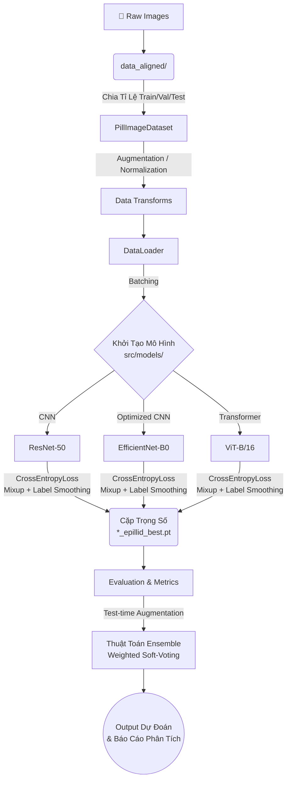

# THUOC - Hệ thống Phân loại Viên thuốc từ Ảnh (Deep Learning)

Dự án này phát triển hệ thống phân loại viên thuốc từ ảnh sử dụng các rẽ nhánh mô hình Deep Learning tiên tiến nhất: **ResNet50**, **EfficientNet-B0**, và **ViT-B/16**. Hệ thống được thiết kế với kiến trúc rõ ràng, chuẩn hóa, hỗ trợ tối đa cho cả nhà phát triển con người và các AI Agent (như Claude Code, Cursor, Windsurf, v.v.) trong việc nắm bắt ranh giới mã nguồn, đóng góp và tự tối ưu hoá code.

---

## 🚀 1. Luồng Hoạt Động Của Hệ Thống (Pipeline)

Quy trình xử lý từ lúc nạp ảnh thô cho đến output dự đoán cuối cùng được biểu diễn dưới dạng sơ đồ luồng chuyên sâu sau:



### Chi tiết giải thuật của từng Model:
Hệ thống kết hợp ba dòng kiến trúc thuật toán để bổ trợ điểm yếu cho nhau (Ensemble):
1. **ResNet50 (Residual Networks):** Sử dụng các khối học thặng dư (Residual Blocks) triệt tiêu vấn đề mất mát gradient (vanishing gradient). Thuật toán này rất mạnh trong việc nắm bắt các đặc trưng cục bộ cứng cáp của viên thuốc như các vạch chia, cạnh và màu sắc cơ bản.
2. **EfficientNet-B0:** Mạng CNN được tự động cân bằng (Compound Scaling) giữa độ sâu (layers), chiều rộng (channels) và độ phân giải hình ảnh. Mô hình này giúp tìm ra các chi tiết nhỏ hoặc dị thường trên bề mặt thuốc một cách vô cùng hiệu quả về mặt tính toán.
3. **ViT-B/16 (Vision Transformer):** Khác biệt hoàn toàn với CNN truyền thống, ViT cắt ảnh viên thuốc thành lưới các mảnh nhỏ (patch) có kích thước 16x16 pixel. Áp dụng cơ chế **Self-Attention** (Tự chú ý) của kiến trúc Transformer, hệ thống học được mối tương quan toàn cục của viên thuốc (Hình dáng tổng thể, text khắc trên hai đầu của thuốc) từ xa thay vì chỉ nhìn cục bộ.

---

## 📂 2. Cấu Trúc Thư Mục & Giải Thích Chi Tiết Từng File

*Ranh giới và chức năng của từng file/thư mục được thiết lập cực kỳ nghiêm ngặt nhằm tránh các AI tự ý định nghĩa sai lệch logic hệ thống.*

```text
THUOC/
├── run_all.py                         # 🎯 Entrypoint tổng: File chạy lệnh gốc điều phối việc đọc data, chạy huấn luyện cả 3 model, sinh báo cáo tập trung và gộp mô hình (Ensemble).
├── train_cli.py                       # 🛠️ Giao diện dòng lệnh (CLI): Chứa chức năng parse tham số để train 1 model cụ thể (`single mode`), tuning tham số (`optimize mode`) hoặc smoke test để debug.
├── requirements.txt                   # 📝 Chứa tất cả các package Python bắt buộc để chạy.
├── AGENTS.md                          # 🤖 RULES cho AI: Tệp chứa Prompt/Khái niệm/Contracts khắt khe (ví dụ: Không bypass factory, giới hạn tên file ảnh) để AI Agent tuân thủ khi viết code.
├── README.md                          # 📖 Tài liệu dự án (File này).
│
├── src/                               # 🧠 CORE LOGIC: Source code chính được phân mảnh chặt chẽ.
│   ├── data/                          # 🗃️ [TIẾP NHẬN & XỬ LÝ DỮ LIỆU]
│   │   ├── features.py                # Chứa `PillImageDataset` để load ảnh, áp dụng random scale/rotate (transform) và map nhãn bằng class_to_idx.
│   │   ├── metadata.py                # Xử lý các mô tả text hoặc file CSV (nếu có) đi kèm đặc tính của viên thuốc.
│   │   └── build_epillid_data.py      # Script chuẩn hóa thư mục (align data): Tạo folder chuẩn train/val/test chung một format.
│   │
│   ├── models/                        # 🏗️ [ĐỊNH NGHĨA KIẾN TRÚC MẠNG]
│   │   ├── resnet50.py                # Define layer ResNet50 + classifier head tùy chỉnh.
│   │   ├── efficientnet_b0.py         # Define cấu trúc mạng EfficientNet-B0.
│   │   ├── vit_b_16.py                # Define cấu trúc Vision Transformer ViT-B/16.
│   │   └── model_factory.py           # Thiết kế Factory Pattern - file DUY NHẤT được gọi sinh model hoặc load file weight dạng `load_checkpoint_class_to_idx`.
│   │
│   ├── training/                      # 🏋️ [TỐI ƯU TRỌNG SỐ]
│   │   └── train.py                   # Chứa vòng lặp Training Loop (Backprop, Loss, mixup) & Val Loop (TTA, EMA, Early Stop). Không gọi logic module khác tại đây.
│   │
│   ├── orchestration/                 # 🎼 [ĐIỀU PHỐI EVENT]
│   │   └── pipeline.py                # Ghép nối luồng dữ liệu chảy qua Model Factory vào file train.py và sang file evaluate_report.py kế tiếp.
│   │
│   ├── evaluation/                    # 📊 [ĐÁNH GIÁ CHẤT LƯỢNG]
│   │   └── evaluate_report.py         # Viết logic lấy kết quả prediction để tính Accuracy, F1-Score, in ra Confusion Matrix. (Chỉ tính toán, tuyệt đối không update weight).
│   │
│   ├── inference/                     # 🔍 [SUY LUẬN TRÊN ẢNH MỚI]
│   │   └── inference.py               # Lọc lấy vector đặc trưng (Feature extraction) trên ảnh chưa từng thấy, kết hợp màu/size/texture để so sánh sự giống nhau giữa 2 viên thuốc.
│   │
│   └── learning/                      # 💡 [ACTIVE LEARNING]
│       └── self_learning.py           # Theo dõi những ảnh dự đoán sai lầm (Hard Examples) lớn để cảnh báo hoặc đề xuất train lại.
│
├── Review/                            # ⚙️ [KHU VỰC TỐI ƯU HYPERPARAMETER]
│   ├── review_terminal.py             # Script tự động phân tích loss/metrics các vòng train để đề xuất config cho vòng sau.
│   └── optimal_configs.py             # 💎 NGUỒN SỰ THẬT: File chứa từ điển hparams (Learning rate, epochs, weight decay) tốt nhất hiện hành. (Cấm hardcode Hparam).
│
├── models/                            # 📦 [ARTIFACTS ĐẦU RA] 
│   ├── *_epillid_best.pt              # Trọng số tốt nhất của 3 mô hình (Bị ignore trên Git).
│   ├── *.metrics.json / .history.json # Tệp lịch sử log các vòng epoch quá trình train.
│   ├── *_training_curves.png          # Đồ thị biểu diễn Learning Curve.
│   ├── evaluation_summary.csv         # Bảng điểm tổng kết sự so sánh chéo 3 model.
│   └── reports/latest/                # Nơi chứa log text và bản đồ nhầm lẫn (Confusion Matrix).
│
├── data_aligned/                      # 📁 Phân vùng dữ liệu đã chuẩn hóa dùng chạy thuật toán (Không commit Git).
├── data/                              # 📁 Dữ liệu thô ban đầu (Không Git).
├── demo_images/                       # 🖼️ Nơi chứa các mẫu ảnh ngoài luồng phục vụ test Inference nhanh.
└── tests/                             # 🧪 [UNIT TESTS TỰ ĐỘNG]
    ├── test_features.py               # Test chức năng transform & load Dataset.
    ├── test_inference_utils.py        # Đảm bảo logic xuất pipeline feature từ ảnh không sai lệch.
    └── test_metadata.py               # File test đọc metadata/mapping label.
```

---

## ⌨️ 3. Hướng Dẫn Cài Đặt và Sử Dụng Cơ Bản

Mở Terminal / Command Prompt và chạy các lệnh dưới đây tùy mục đích:

```bash
# BƯỚC 1: Cài đặt thư viện
pip install -r requirements.txt

# ==========================================
# CÁC LỆNH CHÍNH
# ==========================================

# 1. Chạy full pipeline (Train tất cả model > Load best > Evaluate > Ensemble > Sinh Report)
python run_all.py

# 2. Huấn luyện độc lập 1 mô hình cụ thể (Ví dụ: resnet50 / efficientnet_b0 / vit_b_16)
python train_cli.py --mode single --model resnet50 --epochs 28

# 3. Chạy Hyperparameter tuning (Tìm kiếm config tốt nhất tự động qua nhiều vòng)
python train_cli.py --mode optimize --rounds 3 --epochs 12

# 4. Chỉ đánh giá từ các trọng số mô hình đã có sẵn, KHÔNG huấn luyện lại
python run_all.py --compare-only

# 5. Chạy trên CPU, sử dụng flag này khi máy không hỗ trợ GPU / CUDA
python run_all.py --device cpu

# 6. DEV / DEBUG: Run Smoke Test & Unit Test (Chạy kiểm thử độ sống sót nhanh)
python train_cli.py --mode single --model resnet50 --epochs 2 --batch-size 4   
python -m pytest tests/ -q                                                     
```

---

## 📦 4. Hướng Dẫn Tải Dữ Liệu Gốc (VAIPE 2022)

Các bạn có thể tải dữ liệu đầy đủ `public_train.zip` trong thư mục `File Full`. Ngoài ra, file `public_train.zip` được chia nhỏ để thuận tiện trong quá trình tải dữ liệu. Sau khi tải toàn bộ 5 file liên quan: 

```text
public_train_s.z01
public_train_s.z02
public_train_s.z03
public_train_s.z04
public_train_s.zip
```

Sử dụng lệnh sau để gộp thành 1 file và giải nén (Yêu cầu phiên bản cài đặt ZIP từ `3.0` trở lên):

```bash
zip -s- public_train_s.zip -O public_train.zip
unzip public_train.zip
```

---

## ⚖️ 5. Điều Khoản Sử Dụng Dữ Liệu
Bằng cách tải xuống hoặc truy cập dữ liệu do Ban tổ chức cuộc thi cung cấp theo bất kỳ cách nào, bạn đồng ý với các điều khoản:

- Thí sinh **KHÔNG** được sử dụng dữ liệu khác ngoài tập dữ liệu được cung cấp bởi cuộc thi. Bạn sẽ không phân phối dữ liệu ngoại trừ mục đích phi thương mại và nghiên cứu học thuật.
- Bạn sẽ **không** phân phối, sao chép, tái sản xuất, tiết lộ, chuyển nhượng, cấp phép phụ, nhúng, lưu trữ, chuyển nhượng, bán, giao dịch hoặc bán lại bất kỳ phần nào của dữ liệu do Ban tổ chức cuộc thi cung cấp cho các bên thứ ba dưới bất kỳ hình thức nào.
- Dữ liệu hoàn toàn cấm sử dụng nhằm xâm phạm, phân tách, cô lập một nhóm cá nhân một cách bất hợp pháp.
- Bạn hoàn toàn chịu trách nhiệm cho các khiếu kiện phát sinh nếu vi phạm giấy phép do ban tổ chức (VAIPE) bảo lưu.