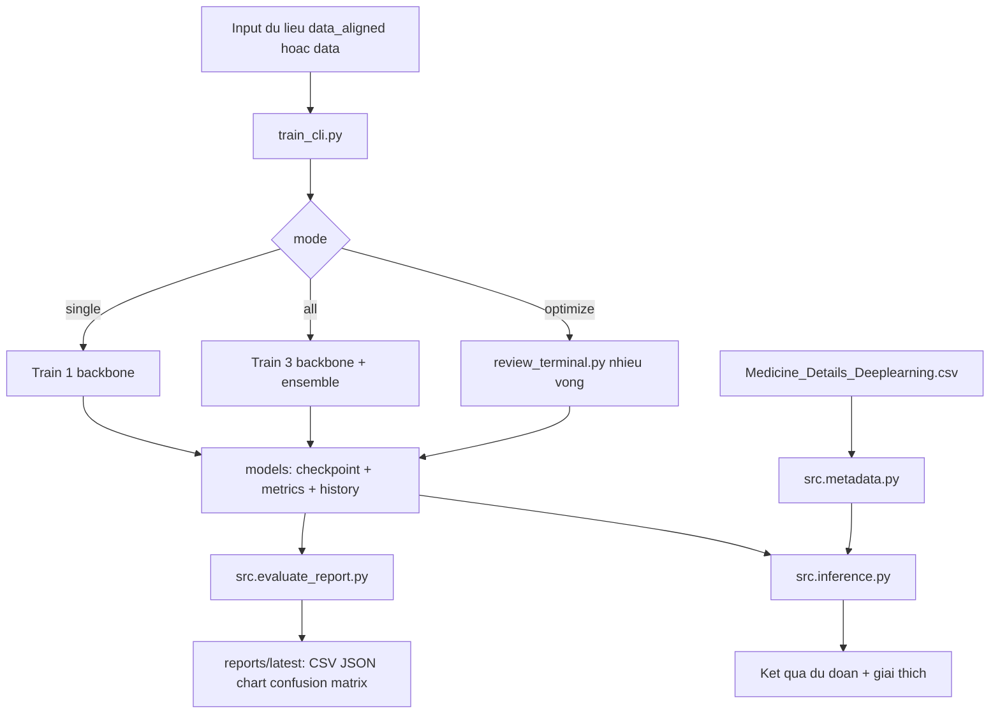
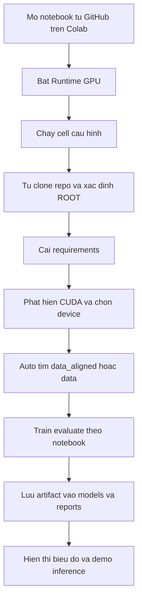

# THUOC - Phan loai vien thuoc tu anh (CLI-first)

Tai lieu nay duoc chuan hoa theo mau nop do an: muc tieu, phuong phap, ket qua, va cach chay.

## 1. Muc tieu de tai

Xay dung he thong phan loai vien thuoc tu anh, ho tro:
1. Train nhieu backbone (ResNet-50, EfficientNet-B0, ViT-B/16).
2. Danh gia chat luong mo hinh bang cac chi so va bieu do.
3. Suy luan tu dong tren anh moi, co ket hop metadata thuoc.
4. Van hanh theo huong CLI-first, de tai lap va de bao cao.

## 2. Cau truc thu muc cap nhat

```text
THUOC/
  README.md
  requirements.txt
  train_cli.py
  review_terminal.py
  run_gui.py
  THUOC_FitLab_GPU_End2End.ipynb

  data/
    Medicine_Details_Deeplearning.csv
    train/<class_name>/*
    val/<class_name>/*
    test/<class_name>/*

  data_aligned/
    train/<class_name>/*
    val/<class_name>/*
    test/<class_name>/*

  demo_images/
    <class_name>/*

  models/
    *_epillid_best.pt
    *_epillid_best.metrics.json
    *_epillid_history.json
    *_training_curves.png
    evaluation_summary.csv
    terminal_review_history.json
    reports/latest/
      evaluation_summary.csv
      evaluation_summary.json
      evaluation_comparison.png
      confusion_matrix_*.png

  src/
    build_epillid_data.py
    evaluate_report.py
    features.py
    gui_tk.py
    inference.py
    metadata.py
    models.py
    pipeline.py
    self_learning.py
    train.py

  tests/
    test_features.py
    test_inference_utils.py
    test_metadata.py
```

## 3. Phuong phap va kien truc

Thanh phan chinh:
1. Data layer: doc va chuan hoa anh theo split train/val/test.
2. Model layer: train backbone, early stopping, luu checkpoint tot nhat.
3. Evaluation layer: tong hop chi so, ve chart va confusion matrix.
4. Inference layer: so sanh dac trung anh, auto ensemble, ket hop metadata.

Suy luan ket hop:
1. Diem truc quan (similarity, color, size, texture).
2. Dieu kien ngu nghia tu metadata (mapping class-thuoc).

## 4. Luong hoat dong end-to-end



## 5. Luong chay tren Colab GPU



Notebook su dung cho Colab:
- [THUOC_FitLab_GPU_End2End.ipynb](THUOC_FitLab_GPU_End2End.ipynb)

## 6. Ket qua dau ra can nop

Toi thieu nen co:
1. Checkpoint tung model trong models.
2. File metrics va history tung model.
3. Bieu do training curves.
4. Bao cao tong hop:
   - evaluation_summary.csv
   - evaluation_summary.json
   - evaluation_comparison.png
   - confusion_matrix cua tung model va ensemble

## 7. Cách Chạy - Quick Start & Tùy Chọn

### 🚀 7.1 Cách Nhanh Nhất (ALL-IN-ONE)

```bash
cd THUOC
python run_all.py
```

✓ Train 3 models với optimal hyperparameters  
✓ Evaluate + Confusion Matrix + Reports  
✓ Generate CSV, JSON, PNG  
⏱️ Thời gian: 20-40 phút (GPU)

### 7.2 Tùy Chọn Khác

```bash
# Train 1 model
python run_all.py --model resnet50

# Chỉ so sánh kết quả (không train)
python run_all.py --compare-only

# Dùng CPU (chậm hơn)
python run_all.py --device cpu

# Custom data directory
python run_all.py --data-dir data_aligned
```

### 7.3 Advanced (train_cli.py - Chi tiết hơn)

```bash
# Full pipeline
python train_cli.py --mode all --epochs 25 --batch-size 16

# 1 model
python train_cli.py --mode single --model resnet50 --epochs 20

# Auto-tuning (tìm optimal config - lâu: 2-4 giờ)
python optimize_hyperparams.py --data-dir data --device cuda
```

### 7.4 Chạy Trên Google Colab

**File**: `THUOC_Colab_Train_Evaluate.ipynb`

1. Mở notebook trên Google Colab
2. Đổi `PROJECT_DIR` → đường dẫn Google Drive của bạn
3. Cell 11 & 12 → Tự động train & evaluate (đã cập nhật optimal configs)
4. Xem kết quả CSV, PNG, confusion matrix

---

## 8. Kết Quả Output (Sau khi chạy run_all.py)

```
models/
├── resnet50_epillid_best.pt              # Checkpoint
├── efficientnet_b0_epillid_best.pt
├── vit_b_16_epillid_best.pt
├── evaluation_summary.csv                # Accuracy, F1-score
├── evaluation_summary.json
├── evaluation_comparison.png             # Bar chart so sánh
├── *_epillid_training_curves.png         # Train/Val curves (3 file)
└── reports/latest/
    ├── confusion_matrix_resnet50.png
    ├── confusion_matrix_efficientnet_b0.png
    ├── confusion_matrix_vit_b_16.png
    ├── confusion_matrix_ensemble.png
    └── evaluation_summary.csv
```

---

## 9. Hyperparameter Tối Ưu Hóa (Train/Val Sát Nhau)

| Model | lr | weight_decay | label_smooth | mixup |
|-------|-----|------|--------|-------|
| **ResNet50** | 8e-5 | 1e-3 | 0.15 | 0.30 |
| **EfficientNet-B0** | 1e-4 | 8e-4 | 0.15 | 0.32 |
| **ViT-B/16** | 1e-4 | 1.2e-3 | 0.18 | 0.38 |

📝 **Edit** `optimal_configs.py` để thay đổi

---

## 10. Kiểm Thử & Xác Thực

```bash
# Run tests
python -m pytest tests/ -q

# Kiểm tra data integrity
python -c "from src.features import PillImageDataset; ds = PillImageDataset('data', split='train'); print(f'Train images: {len(ds)}')"
```

---

## 11. Các Updates & Tối Ưu (v2.0 - Mar 2026)

✅ **run_all.py**: All-in-one setup (train + eval + report trong 1 lệnh)  
✅ **optimal_configs.py**: Hyperparameters đã tối ưu cho 3 models  
✅ **Colab Notebook**: Cập nhật Cell 11-12 (optimal hyperparams + evaluation)  
✅ **Bug Fixes**: UTF-8 encoding, checkpoint loading, confusion matrix  
✅ **Cleanup**: Xóa unnecessary scripts (train_optimized.py, etc.)  
✅ **Documentation**: README đầy đủ & sẵn sàng nộp

---

## 12. Hướng Dẫn Nộp Đồ Án

Chuẩn bị:

1. **Source Code**: `src/` folder đầy đủ
2. **Checkpoints**: 3 file `*_epillid_best.pt`
3. **Reports**:
   - `models/evaluation_summary.csv`
   - `models/evaluation_comparison.png`
   - `models/reports/latest/confusion_matrix_*.png` (3+ file)
   - `models/*_epillid_training_curves.png` (3+ file)

Chạy:
```bash
python run_all.py
```

Nộp: Folder `models/` + `src/` + `README.md`