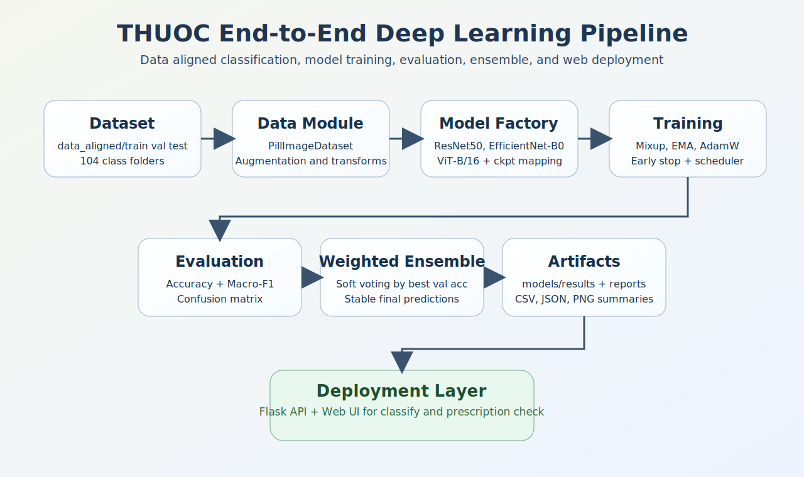
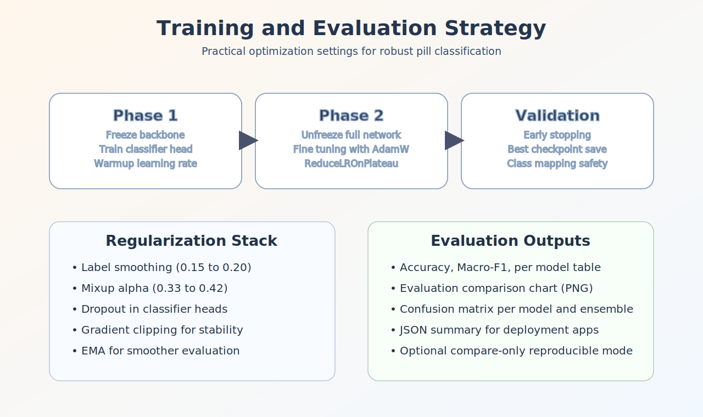
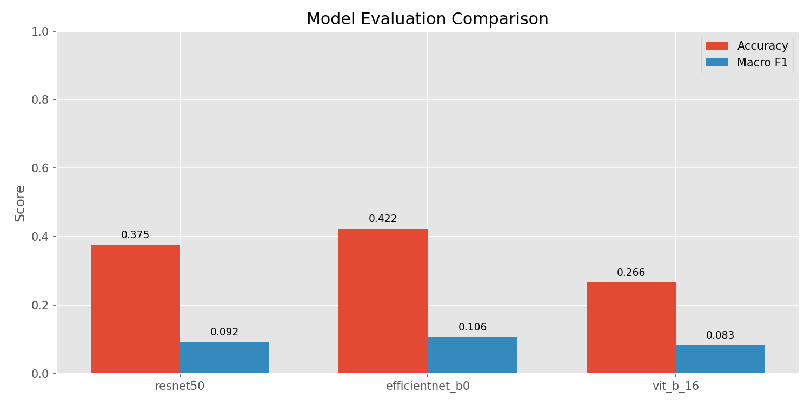
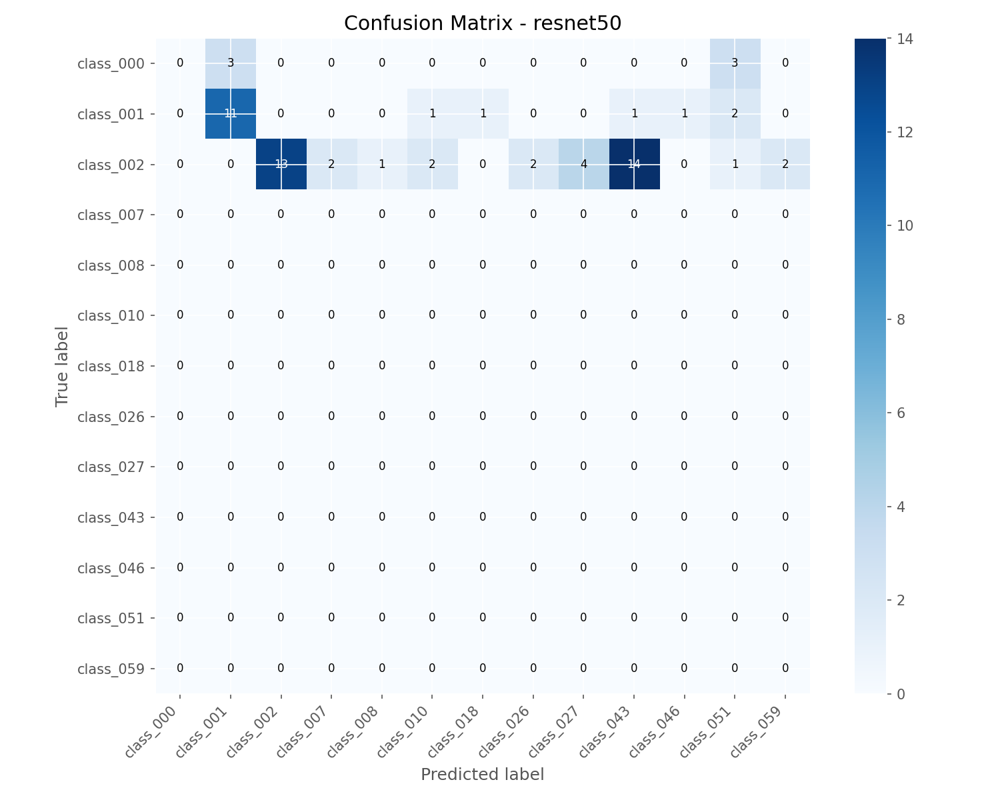
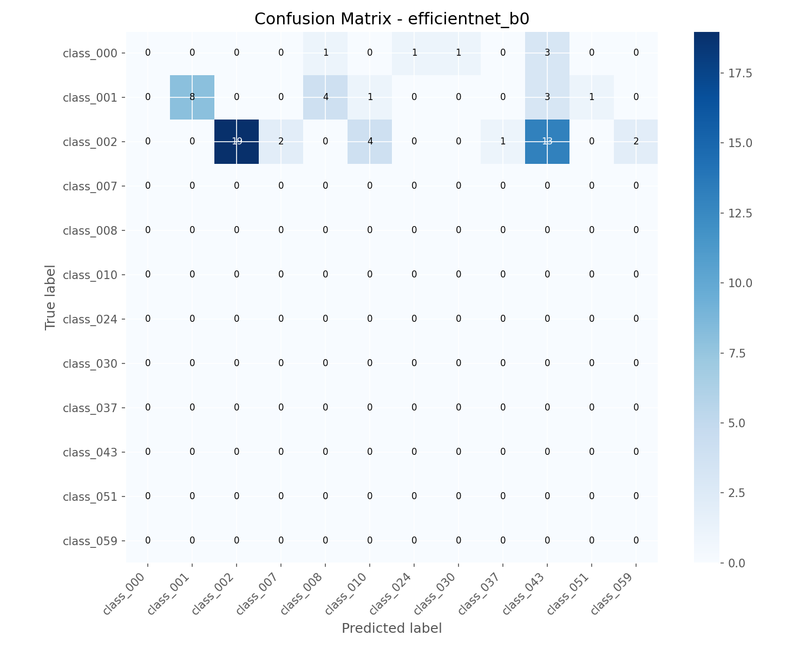
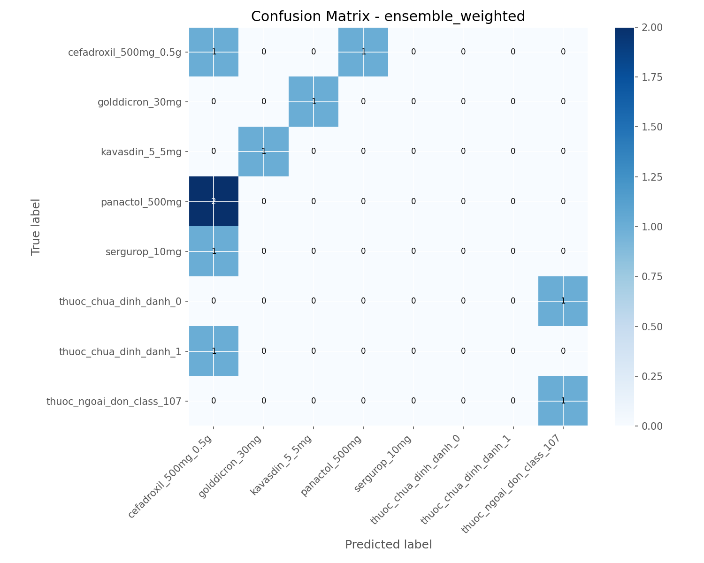
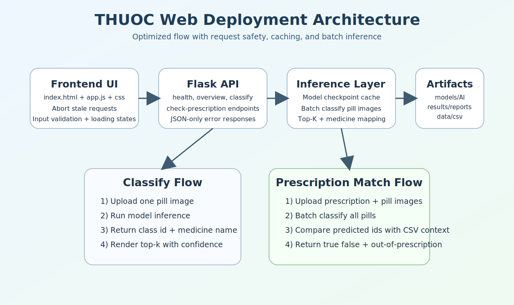
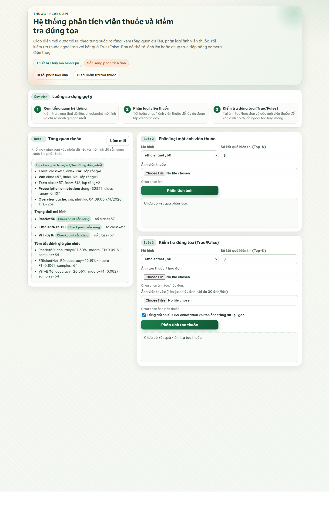
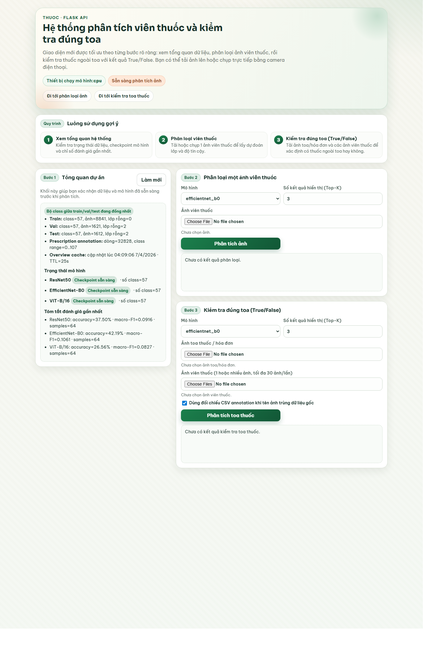

# 💊 THUOC - Hệ thống phân loại viên thuốc bằng Deep Learning

> **Nhóm nghiên cứu:** VLU.AI-Med Team - Trường Đại học Văn Lang  
> **Học phần:** Nhập môn Phân tích dữ liệu và Học sâu  
> **Định hướng:** Nghiên cứu khoa học sinh viên, ứng dụng AI vào bài toán y tế số

---

## 📑 Mục lục
- [1. Tóm tắt đề tài](#1-tóm-tắt-đề-tài)
- [2. Mục tiêu và phạm vi nghiên cứu](#2-mục-tiêu-và-phạm-vi-nghiên-cứu)
- [3. Kiến trúc hệ thống](#3-kiến-trúc-hệ-thống)
- [4. Dữ liệu và tiền xử lý](#4-dữ-liệu-và-tiền-xử-lý)
- [5. Phương pháp mô hình](#5-phương-pháp-mô-hình)
- [6. Chiến lược huấn luyện](#6-chiến-lược-huấn-luyện)
- [7. Kết quả thực nghiệm và hình minh họa](#7-kết-quả-thực-nghiệm-và-hình-minh-họa)
- [8. Triển khai Web và tích hợp hệ thống](#8-triển-khai-web-và-tích-hợp-hệ-thống)
- [9. Hướng dẫn cài đặt và vận hành](#9-hướng-dẫn-cài-đặt-và-vận-hành)
- [10. Câu hỏi thường gặp (FAQ)](#10-câu-hỏi-thường-gặp-faq)
- [11. Lợi ích thực tiễn và hướng phát triển tương lai](#11-lợi-ích-thực-tiễn-và-hướng-phát-triển-tương-lai)
- [12. Cấu trúc dự án](#12-cấu-trúc-dự-án)
- [13. Đóng góp nhóm nghiên cứu](#13-đóng-góp-nhóm-nghiên-cứu)
- [14. Giấy phép](#14-giấy-phép)

---

## 1. Tóm tắt đề tài
THUOC là hệ thống nhận diện viên thuốc từ ảnh sử dụng deep learning, hướng tới hai bài toán thực tế:

- Phân loại ảnh viên thuốc theo lớp thuốc.
- Kiểm tra thuốc có thuộc toa hay ngoài toa (true/false) bằng ngữ cảnh đơn thuốc.

Dự án xây dựng pipeline đầy đủ từ huấn luyện đến triển khai:

- Train nhiều mô hình (ResNet50, EfficientNet-B0, ViT-B/16).
- Evaluate và so sánh bằng Accuracy, Macro-F1, confusion matrix.
- Ensemble soft-voting để tăng độ ổn định.
- Triển khai Web Flask cho thao tác thực tế trên ảnh upload/camera.

---

## 2. Mục tiêu và phạm vi nghiên cứu
### 2.1. Mục tiêu
- Xây dựng quy trình phân loại ảnh viên thuốc có thể tái sử dụng trong môi trường học thuật và nghiên cứu ứng dụng.
- Tạo giao diện Web dễ dùng cho người dùng không chuyên kỹ thuật.
- Đảm bảo đầu ra rõ ràng cho bài toán hỗ trợ kiểm soát đơn thuốc.

### 2.2. Phạm vi
- Dữ liệu ưu tiên: data_aligned, cấu trúc train/val/test đồng nhất class folders.
- Số lớp không hardcode, phụ thuộc dataset/checkpoint.
- Triển khai infer trên CPU mặc định, hỗ trợ CUDA khi khả dụng.

---

## 3. Kiến trúc hệ thống



Pipeline gồm 6 lớp chức năng:

1. Data module: đọc ảnh và augmentation.
2. Model factory: khởi tạo/tải checkpoint đúng class mapping.
3. Training engine: tối ưu mô hình với regularization.
4. Evaluation: đo hiệu năng chi tiết.
5. Ensemble: kết hợp xác suất nhiều mô hình.
6. Runtime/Web: cung cấp API và giao diện sử dụng.

---

## 4. Dữ liệu và tiền xử lý
### 4.1. Cấu trúc dữ liệu chuẩn

- data_aligned/train/class_xxx/*.jpg
- data_aligned/val/class_xxx/*.jpg
- data_aligned/test/class_xxx/*.jpg

### 4.2. Các nguyên tắc dữ liệu quan trọng
- Bộ class giữa train/val/test phải đồng nhất.
- Tuple đầu ra dataset chuẩn: (image_tensor, class_idx, image_path).
- Prescription matching dùng target_class_id 0..107, trong đó 107 là out_of_prescription.

### 4.3. Tiền xử lý chính
- Focus vùng viên thuốc trước khi đưa vào mô hình.
- Biến đổi ảnh train/val/test theo profile phù hợp.
- Chuẩn hóa thống nhất để đảm bảo so sánh giữa mô hình công bằng.

---

## 5. Phương pháp mô hình

| Mô hình | Vai trò trong nghiên cứu | Điểm mạnh |
|---|---|---|
| ResNet50 | Baseline CNN mạnh, ổn định | Dễ hội tụ, kiểm soát overfit tốt |
| EfficientNet-B0 | Mô hình nhẹ, hiệu quả tham số | Cân bằng tốc độ và chất lượng |
| ViT-B/16 | Mô hình transformer thị giác | Khai thác ngữ cảnh toàn cục tốt |

### 5.1. Nguyên tắc an toàn class mapping
- Không hardcode num_classes.
- Khi infer/evaluate từ checkpoint phải đọc class_to_idx trong checkpoint.
- Mục tiêu: tránh lệch nhãn khi dữ liệu thay đổi.

---

## 6. Chiến lược huấn luyện



### 6.1. Kỹ thuật tối ưu chính
- Huấn luyện theo pha freeze/unfreeze.
- Optimizer AdamW + scheduler ReduceLROnPlateau.
- Early stopping, gradient clipping, EMA, mixup, label smoothing.

### 6.2. Cấu hình mặc định đang dùng

| Model | lr | weight_decay | label_smoothing | mixup_alpha | epochs | patience |
|---|---:|---:|---:|---:|---:|---:|
| ResNet50 | 6e-5 | 1.2e-3 | 0.16 | 0.35 | 28 | 6 |
| EfficientNet-B0 | 7e-5 | 1e-3 | 0.15 | 0.33 | 28 | 6 |
| ViT-B/16 | 5e-5 | 1.4e-3 | 0.20 | 0.42 | 32 | 7 |

---

## 7. Kết quả thực nghiệm và hình minh họa

### 7.1. Biểu đồ so sánh mô hình



### 7.2. Confusion matrix theo mô hình







### 7.3. File kết quả nghiên cứu đi kèm
- models/results/evaluation/evaluation_summary.csv
- models/results/training/training_results_table.csv
- models/reports/latest/evaluation_summary.json

### 7.4. Benchmark tốc độ suy luận (Web API)

Nguồn benchmark chi tiết:

- docs/benchmarks/inference_benchmark.json
- docs/benchmarks/inference_benchmark.md

| Endpoint Scenario | Device | Runs | Mean (ms) | P50 (ms) | P95 (ms) | Min (ms) | Max (ms) |
|---|---|---:|---:|---:|---:|---:|---:|
| classify_single_image | cpu | 12 | 524.34 | 523.44 | 572.28 | 492.86 | 608.54 |
| check_prescription_two_pills | cpu | 8 | 2062.26 | 2038.40 | 2348.78 | 1764.43 | 2408.32 |
| classify_single_image | cuda | - | N/A | N/A | N/A | N/A | N/A |
| check_prescription_two_pills | cuda | - | N/A | N/A | N/A | N/A | N/A |

Ghi chú: môi trường benchmark hiện tại chưa có CUDA, do đó chưa có số đo GPU.

Lưu ý: nếu chưa có ảnh/biểu đồ, chạy lại compare-only để sinh artifacts:

```bash
python run_all.py --compare-only
```

---

## 8. Triển khai Web và tích hợp hệ thống



### 8.1. Ảnh giao diện Web thực tế





Ghi chú: ảnh desktop được chụp trực tiếp từ web app local đang chạy; ảnh mobile preview được thu gọn theo tỷ lệ từ ảnh chụp thật để phục vụ bố cục báo cáo.

Web app hỗ trợ 2 quy trình:

1. Classify: phân loại 1 ảnh viên thuốc.
2. Check-prescription: phân tích nhiều ảnh viên thuốc theo ngữ cảnh toa thuốc.

Các điểm tối ưu trong bản hiện tại:

- API overview có cache TTL giúp phản hồi nhanh hơn.
- Batch inference cho nhiều ảnh pill trong một lần suy luận.
- Hạn chế request lỗi bằng validate input rõ ràng.
- Frontend tự hủy request cũ khi người dùng bấm gửi liên tục.

Tài liệu chi tiết phần web: xem Web/README.md.

---

## 9. Hướng dẫn cài đặt và vận hành

### 9.1. Cài thư viện
```bash
pip install -r requirements.txt
```

### 9.2. Chạy pipeline đầy đủ
```bash
python run_all.py
```

### 9.3. Chỉ đánh giá checkpoint có sẵn
```bash
python run_all.py --compare-only
```

### 9.4. Chạy Web app
```bash
python Web/app.py
```

### 9.5. Kiểm thử
```bash
python -m pytest tests/ -q
```

---

## 10. Câu hỏi thường gặp (FAQ)
### Q1. Vì sao không hardcode số lớp?
Vì số lớp thực tế phụ thuộc dataset/checkpoint. Hardcode dễ gây lệch nhãn khi cập nhật dữ liệu.

### Q2. Vì sao cần ensemble?
Ensemble giảm dao động dự đoán từng mô hình đơn lẻ, giúp kết quả ổn định hơn trong tình huống ảnh khó.

### Q3. Khi nào trả về true/false trong prescription?
- true: tất cả viên thuốc thuộc lớp trong toa.
- false: có ít nhất một viên thuộc ngoài toa.
- null: chưa đủ ngữ cảnh để kết luận chắc chắn.

### Q4. Có thể mở rộng tích hợp thực tế không?
Có. Hệ thống có API rõ ràng nên dễ tích hợp vào dashboard, kiosk y tế hoặc ứng dụng nội bộ.

---

## 11. Lợi ích thực tiễn và hướng phát triển tương lai
### 11.1. Lợi ích thực tiễn
- Hỗ trợ kiểm soát phát thuốc đúng toa.
- Giảm sai sót trong bước kiểm tra thủ công.
- Tạo dữ liệu phân tích cho hoạt động dược lâm sàng.

### 11.2. Hướng tích hợp tương lai
- Tích hợp OCR từ ảnh toa thuốc để tự động trích xuất đơn.
- Tích hợp hệ thống quản lý nhà thuốc/bệnh viện.
- Mở rộng sang mô hình đa ảnh/đa modal và giám sát theo thời gian thực.
- Đóng gói thành dịch vụ API dùng cho mobile app.

---

## 12. Cấu trúc dự án

```text
THUOC/
├── run_all.py
├── train_cli.py
├── Web/
├── src/
│   ├── data/
│   ├── models/
│   ├── training/
│   ├── evaluation/
│   ├── inference/
│   └── orchestration/
├── Review/
├── models/
├── data_aligned/
├── tests/
└── docs/
    └── figures/
```

---

## 13. Đóng góp nhóm nghiên cứu

| Hạng mục | Nội dung thực hiện |
|---|---|
| Nghiên cứu mô hình | So sánh ResNet50, EfficientNet-B0, ViT-B/16 |
| Huấn luyện và tuning | Thiết lập cấu hình tối ưu, theo dõi overfit |
| Đánh giá thực nghiệm | Tổng hợp metrics, confusion matrix, bảng so sánh |
| Triển khai hệ thống | Xây dựng API Flask và giao diện Web |
| Tài liệu khoa học | Viết báo cáo kỹ thuật, giải thích kết quả và hướng ứng dụng |

---

## 14. Giấy phép
Dự án phát hành theo giấy phép MIT cho mục đích học tập và nghiên cứu.

Nếu sử dụng dữ liệu/ảnh trong báo cáo hoặc demo, vui lòng tuân thủ điều khoản dữ liệu của đơn vị cung cấp.
