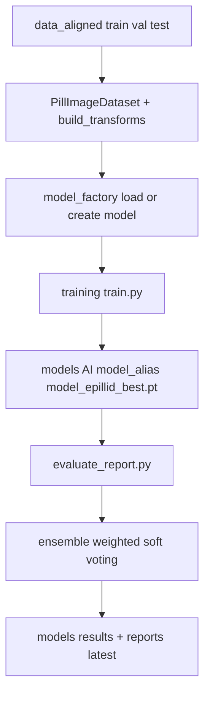

# THUOC - He thong phan loai vien thuoc tu anh

THUOC la du an nhan dien va phan loai vien thuoc bang deep learning, toi uu cho quy trinh train -> evaluate -> ensemble -> report, dong thoi ho tro luong prescription_match de doi chieu vien thuoc voi don thuoc.

Tai lieu nay mo ta trang thai codebase hien tai:
- Cau truc thu muc va vai tro tung module
- Luong pipeline dang chay trong code
- Vi tri artifact dau ra theo chuan moi
- Lenh su dung chinh xac voi CLI hien tai

## 1) Tong quan nhanh

- Bai toan chinh: image classification theo class folder trong data_aligned
- So lop khong hardcode: num_classes duoc suy ra tu dataset/checkpoint
- Trang thai dataset hien tai: data_aligned train/val/test dang co 104 class folders moi split
- Model dang su dung: resnet50, efficientnet_b0, vit_b_16 (ensemble soft-voting)
- Framework: PyTorch + torchvision, Python 3.10+
- Nguon su that ve hparams: Review/optimal_configs.py

## 2) Luong pipeline dang trien khai



### Ky thuat train/eval dang dung

- Stage train 2 pha: freeze backbone -> unfreeze full model
- Loss va regularization: CrossEntropy + label smoothing + mixup
- On-training stability: AdamW, ReduceLROnPlateau, gradient clipping, early stopping
- On-eval robustness: TTA, EMA
- Offline-safe pretrained: fallback random init trong model factory

## 3) Cau truc thu muc theo he thong hien tai

```text
THUOC/
├── AGENTS.md
├── README.md
├── requirements.txt
├── run_all.py
├── train_cli.py
│
├── Review/
│   ├── optimal_configs.py
│   └── review_terminal.py
│
├── src/
│   ├── data/
│   │   ├── build_epillid_data.py
│   │   ├── data_setup.py
│   │   ├── features.py
│   │   ├── metadata.py
│   │   └── prescription_csv_builder.py
│   ├── models/
│   │   ├── resnet50.py
│   │   ├── efficientnet_b0.py
│   │   ├── vit_b_16.py
│   │   └── model_factory.py
│   ├── training/train.py
│   ├── orchestration/pipeline.py
│   ├── evaluation/evaluate_report.py
│   ├── inference/
│   │   ├── inference.py
│   │   ├── prescription_matching.py
│   │   └── README_prescription_matching.md
│   └── utils/
│       ├── model_paths.py
│       └── runtime_artifacts.py
│
├── tests/
├── data/
├── data_aligned/
├── models/
│   ├── AI/
│   │   ├── resnet50/
│   │   ├── efficientnet/
│   │   └── vit_b_16/
│   ├── results/
│   │   ├── evaluation/
│   │   └── training/
│   └── reports/latest/
├── log/
└── json/
```

## 4) Lenh su dung chinh

```bash
pip install -r requirements.txt

# Full pipeline (train + eval + report)
python run_all.py

# Chi evaluate tren checkpoint co san
python run_all.py --compare-only

# CPU mode
python run_all.py --device cpu

# Train 1 model
python train_cli.py --mode single --model resnet50 --epochs 28
python train_cli.py --mode single --model efficientnet_b0 --epochs 28
python train_cli.py --mode single --model vit_b_16 --epochs 32

# Tuning nhieu vong
python train_cli.py --mode optimize --rounds 3 --epochs 12

# Smoke test
python train_cli.py --mode single --model resnet50 --epochs 2 --batch-size 4

# Unit tests
python -m pytest tests/ -q
```

Prescription matching:

```bash
python train_cli.py --mode prescription_match --prescription-image data/images/public_train/prescription/image/VAIPE_P_TRAIN_0.png --pill-images data/images/public_train/pill/image/VAIPE_P_0_0.jpg data/images/public_train/pill/image/VAIPE_P_0_1.jpg --pretty

python train_cli.py --mode prescription_match --prescription-image data/images/public_train/prescription/image/VAIPE_P_TRAIN_0.png --pill-images data/images/public_train/pill/image/VAIPE_P_0_0.jpg data/images/public_train/pill/image/VAIPE_P_0_1.jpg --output-json json/prescription_match_latest.json --output-csv models/reports/latest/prescription_match.csv --pretty
```

Build data tu ePillID (chi khi can import ePillID benchmark):

```bash
python src/data/build_epillid_data.py --epillid-root <duong_dan_epillid> --img-root <duong_dan_anh> --output-root data_aligned
```

Luu y: run_all.py va train_cli.py da co co che discover_or_prepare_data_dir de uu tien data_aligned va tu dong tao lai neu tim thay raw VAIPE.

## 5) Contracts quan trong

- Dataset structure bat buoc: data_aligned/train|val|test/class/*.jpg
- 3 split phai cung tap class folder de tranh sai class mapping
- Dataset tuple output phai giu nguyen thu tu: (image_tensor, class_idx, image_path)
- Luon khoi tao/load model qua src/models/model_factory.py
- Khi infer/evaluate tu checkpoint, uu tien load_checkpoint_class_to_idx de dong bo mapping class

## 6) Vi tri artifact dau ra (chuan hien tai)

Theo chuan moi, artifact duoc sap theo model alias va theo loai ket qua:

- Checkpoint + history + metrics + curves:
  - models/AI/resnet50/resnet50_epillid_best.pt
  - models/AI/efficientnet/efficientnet_b0_epillid_best.pt
  - models/AI/vit_b_16/vit_b_16_epillid_best.pt
- Tong hop evaluate:
  - models/results/evaluation/evaluation_summary.csv
  - models/results/evaluation/evaluation_comparison.png
- Bang tong hop train:
  - models/results/training/training_results_table.csv
  - models/results/training/training_results_table.md
- JSON + confusion matrix:
  - models/reports/latest/evaluation_summary.json
  - models/reports/latest/confusion_matrix_*.png

## 7) Quick verify truoc khi nop

```bash
python -m pytest tests/ -q
python run_all.py --compare-only
```

## 8) Luu y du lieu va ban quyen

- Khong commit data/, data_aligned/, models/*.pt
- Chi su dung du lieu theo dung dieu khoan ban to chuc cung cap
- Nen mo rong gitignore de tranh day nham artifact lon